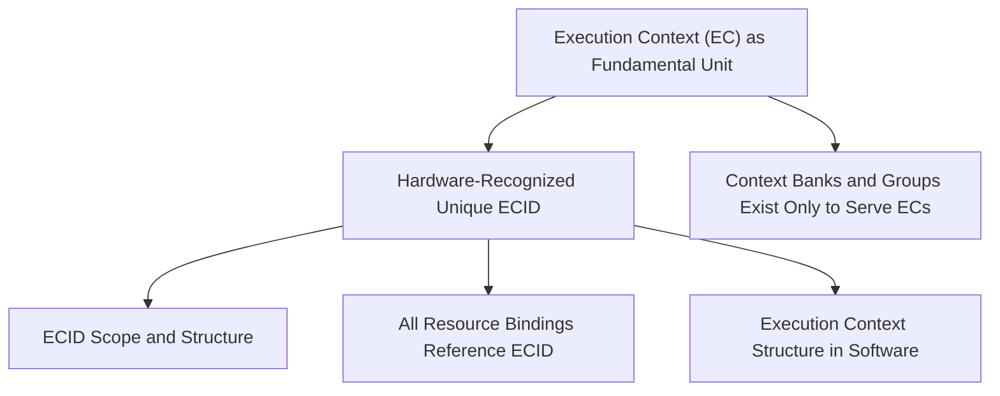

# Context Extensions (CE) – Tree of Truths

## Root: Execution Context Fundamentals

### R1. [AXIOM] Execution Context (EC) as Fundamental Unit
> An **execution context** (EC) is the indivisible, schedulable unit of computation and resource ownership in the CE suite.  
> *Examples: thread, process, VM/vCPU, container, secure enclave, interrupt handler.*
>
> - [See: Chapter 1, “Execution Context Model”](Chapter1-Execution_Context_Model.md)

**Justification:**  
All resource management, scheduling, isolation, and privilege transitions in CE are defined with respect to ECs. If the EC concept is ill-defined, all downstream mechanisms become ambiguous.

---

### R2. [AXIOM] Hardware-Recognized Unique ECID
> Every EC is bound to a **hardware-recognized Execution Context Identifier (ECID)**, which uniquely distinguishes it on the hart(s) where it can run.  
> The ECID securely associates all CE-managed resources (context banks, cache partitions, QoS, memory slots, etc.) to that EC.
>
> - [See: Chapter 1, “The ECID Model”](Chapter1-Execution_Context_Model.md#the-ecid-model)

**Justification:**  
Uniqueness and binding via ECID are required for:  
- Fast and unambiguous context switches (hardware knows “who owns what”)
- Enforcing security boundaries
- Tracking delegated resources (including virtualization and nested VMs)
- Avoiding cross-hart synchronization for ECID allocation

---

### R3. [DERIVED] ECID Scope and Structure
> ECIDs are:
> - **Locally unique per hart** (not globally unique across system)
> - Combined with hart/thread ID to form a globally unique tuple per running context
> - Not required to be globally tracked by the OS; hardware and OS maintain ECID mapping as part of per-hart context tables.
>
> - [See: Chapter 1, “The ECID Model”](Chapter1-Execution_Context_Model.md#the-ecid-model)

**Justification:**  
This reduces cross-hart coordination overhead, avoids global bottlenecks, and allows scalable virtualization/parallelism.

---

### R4. [DERIVED] All Resource Bindings Reference ECID
> All CE resource mappings (context banks, group IDs, cache partitions, QoS channels, memory scheduling slots) are explicitly or implicitly bound to the *current* ECID on a hart.
>
> - [See: Chapter 1, “Core Concepts”, “Bank Group and Visibility Model”](Chapter1-Execution_Context_Model.md#core-concepts)

**Justification:**  
Direct binding to ECID ensures isolation, accountability, and fast switching. Without this, delegation and resource tracking would require slow or unsafe indirection.

---

### R5. [DERIVED] Execution Context Structure in Software
> The OS must maintain a software-visible **execution context structure** (ECS) for each EC, storing at least the ECID and pointers to any bound resources.
>
> - [See: Chapter 5, “Unified Execution Context Structure”](Chapter5-Linux_Kernel_Integration.md#2-unified-execution-context-structure)

**Justification:**  
The ECS enables hardware-software handshake, fast save/restore, and resource reclamation upon EC termination.

---

### R6. [DERIVED] Context Banks and Groups Exist Only to Serve ECs
> All context banks and groups are managed, allocated, and delegated in service of one or more ECs, never as free-floating resources.
>
> - [See: Chapter 1, “Context Bank Types”, “Bank Group and Visibility Model”](Chapter1-Execution_Context_Model.md#context-bank-types)

**Justification:**  
No bank or group can be owned or accessed outside the EC model; this enforces strict security/isolation and matches the fundamental abstraction.

---

## [Next Branch]: Context Banks, Groups, and Delegation

(Here, you’ll derive the need, design, and constraints for context banks, group delegation, visibility, etc., each justified by how they enable or constrain EC/ECID needs.)

---

## Placeholder: Mermaid.js Example (Can be expanded)

